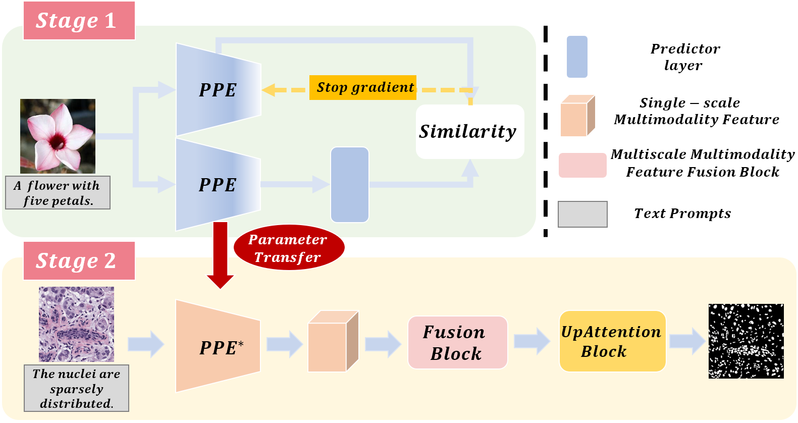

# MPTPN-for--Medical-Image-Segmentation

##  This is an official implementation of "Multiscale Progressive Text Prompt Network for Medical Image Segmentation".

<p align='center'>  
  
</p>


# Introduction

The accurate segmentation of medical images is a crucial step in obtaining reliable morphological statistics. However, training a deep neural network for this task requires a large amount of labeled data to ensure high-accuracy results. To address this issue, we propose using progressive text prompts as prior knowledge to guide the segmentation process. Our model consists of two stages. In the first stage, we perform contrastive learning on natural images to pretrain a powerful prior prompt encoder (PPE). This PPE leverages text prior prompts to generate single-scale multimodality features. In the second stage, medical images and text prior prompts are fed into the PPE from the first stage to achieve the downstream medical image segmentation task. A multiscale feature fusion block (MSFF) combines the features from the PPE to produce multiscale multimodality features. These two progressive features not only bridge the semantic gap but also improve prediction accuracy. Finally, an UpAttention block refines the predicted results by merging the image and text features. This design enables a simple and accurate way to leverage multiscale progressive text prior prompts for medical image segmentation. Compared with using only images, our model achieves high-quality results with low data annotation costs. Moreover, our model not only has excellent reliability and validity on medical images but also performs well on natural images. The experimental results on different image datasets demonstrate that our model is effective and robust for image segmentation. We will release our code after publication.


## Dependencies
- Python 3.8
- [PyTorch >= 1.8](https://pytorch.org/)
- cudatoolkit 10.1 

## Requirements
Install from the ```requirements.txt``` using:
```
pip install -r requirements.txt
```

## Usage

### 1. Data Preparation
#### 1.1. MoNuSeg Datasets
The original data can be downloaded in following links:
* MoNuSeG Dataset - [Link (Original)](https://monuseg.grand-challenge.org/Data/)

#### 1.2. Format Preparation

Then prepare the datasets in the following format for easy use of the code:

```
├── datasets
    ├── MoNuSeg
    │   ├── Test_Folder
    |   |   ├── Test_text.xlsx
    │   │   ├── img
    │   │   └── labelcol
    │   ├── Train_Folder
    |   |   ├── Train_text.xlsx
    │   │   ├── img
    │   │   └── labelcol
    │   └── Val_Folder
    |       ├── Val_text.xlsx
    │       ├── img
    │       └── labelcol
```

### 2. Training

#### 2.1. Pre-training
Training PPE with contrastive learning
```
python main_simsiam_natural.py –-data ‘enter train directory’
```

#### 2.2. Training

You can train to get your own model. It should be noted that using the pre-trained model in the step 2.1 will get better performance.

```
python train_model.py
```

### 3. Test
First, change the session name in ```Config.py``` as the training phase. Then run:
```
python test_model.py
```

## Reference


* [LViT](https://github.com/HUANGLIZI/LViT/)
* [SimSiam](https://github.com/PatrickHua/SimSiam)
* [SwinUnet](https://github.com/HuCaoFighting/Swin-Unet)
* [GTUNet](https://github.com/kent0n-li/gt-u-net)
* [MedT](https://github.com/jeya-maria-jose/Medical-Transformer)
* [UCTransNet](https://github.com/McGregorWwww/UCTransNet)
